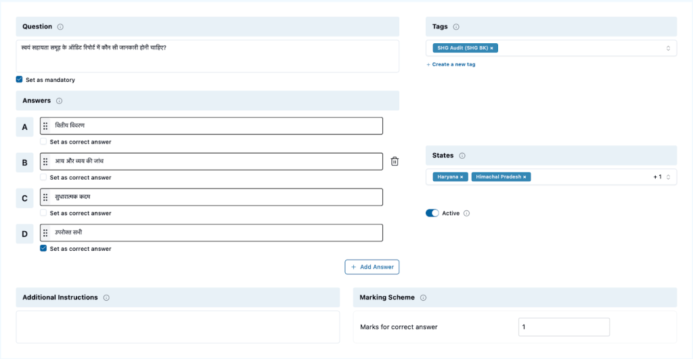
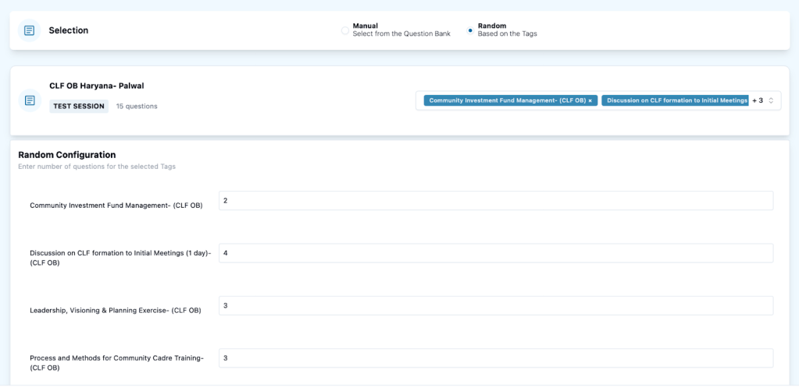
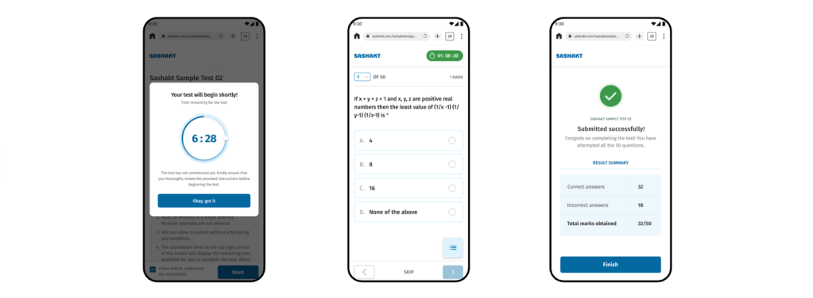
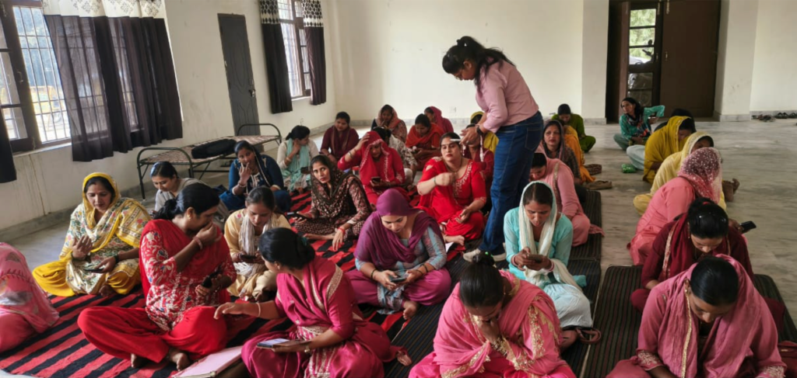

We introduced Sashakt — but what is it really made of? How is it structured, how flexible is its design, and why has it proven effective for large-scale field assessments?

Let's explore the architecture, the design choices, and the technology that power Sashakt from the inside out.

{/* truncate */}

## The Architecture

Sashakt functions as a **multi-tenant platform**, allowing multiple organizations to operate independently and securely within the same system. Five core pillars hold everything together:

- **Users** — role-based access across the organization
- **Tests** — flexible, reusable assessment blueprints
- **Questions** — a centralized, reusable question bank
- **Tags** — organizational labels for filtering and grouping
- **Candidates** — the individuals being assessed

Together, these enable a smooth assessment lifecycle — from question creation to result analytics.

## User Management

Sashakt's role-based access structure has four hierarchical levels, each with a distinct responsibility:

- **Super Admin** — System architects managing organizational onboarding and global configurations
- **System Admin** — Organization-level management of users, configurations, and assessments
- **State Admin** — Regional managers handling localized data and operations
- **Test Admin** — Assessment designers who create, publish, and manage tests

This layered structure ensures organization and scalability across diverse teams, no matter the size of the deployment.

## Question Management

Organizations create questions once through a **centralized question bank**, enabling reuse across multiple assessments without duplication. Each question is fully customizable:

- Question text and type (single or multiple choice)
- Answer options and instructions
- Marks and difficulty level
- Organizational tags and location labels

Create once. Reuse everywhere.

## Bulk Upload – Content at Scale

For organizations with large question banks, Sashakt supports **CSV template uploads** to add content in bulk. The system doesn't just fail silently — it provides a clear, pinpointed report telling you exactly what to fix, enabling rapid corrections without starting over.

## Test Management

Test templates act as **flexible blueprints** that can be customized and reused across batches or departments. Questions can be added in two ways:

- **Manual selection** — pick specific questions by hand
- **Tag-based selection** — automatically pull questions matching criteria like difficulty, topic, or location

Need to run the same assessment for a new batch? **Clone the entire configuration** — questions, settings, everything — instantly.

## Tag Management

Tags are the organizational backbone of Sashakt. They enable powerful filtering and management across the platform.

A real-world example from Veddis Foundation: content was tagged by training areas like *"SHG Audit," "Meeting Process,"* and *"Concept & Management."* When building a test, matching questions were pulled automatically — no manual hunting required.

## Assessment Management

Field officers can conduct assessments even in **low-connectivity areas** using printed QR codes. Candidates scan the code to access a clean, mobile-friendly interface, complete their test, and — when enabled — view their results immediately after submission.

No app install. No internet dependency. Just a QR code and a mobile browser.

## Built on a Stack That Doesn't Slow Down

Sashakt is built on a modern, proven technology stack:

| Layer | Technology |
|---|---|
| Backend | FastAPI |
| Database | PostgreSQL |
| Frontend | Svelte + shadcn/ui |
| Deployment | Docker + AWS Cloud |
| Analytics | BigQuery + Looker Studio |

Each choice prioritizes reliability and performance at scale — because when you're running assessments across thousands of candidates in remote districts, there's no room for downtime.

## What's Next: The Vision for Sashakt 2.0

So far, Sashakt has enabled over **8,500 candidates** across **31 districts** in Haryana and Himachal Pradesh, generating more than **2 lakh responses**.

Sashakt 2.0 is already underway, with planned additions including:

- Advanced question types
- Improved analytics and reporting
- Richer feedback tools
- Deeper personalization for candidates

The mission remains the same: make assessments **simple, reliable, and truly accessible for everyone**.

> *Want to explore Sashakt for your organization? Reach out to the Project Tech4Dev team — we'd love to collaborate.*
