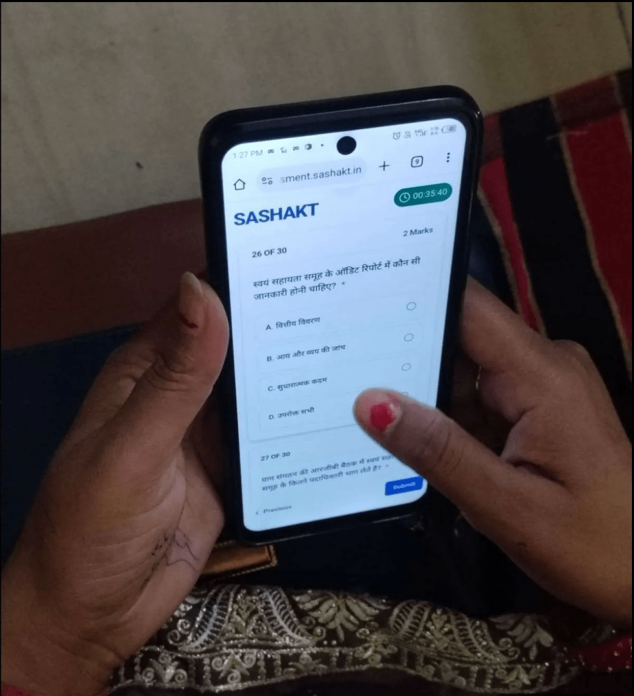

Assessments are a critical but often painful part of work in the non-profit and social impact space. Organizations struggle with creating tests, securely storing results, and analyzing evaluations efficiently — all without standardized, affordable tools.

Project Tech4Dev has launched **Project Sashakt**, an open-source platform designed to help nonprofits and social impact organizations conduct assessments at scale.

{/* truncate */}

## The Problem

The social sector lacks accessible, purpose-built tools for conducting large-scale assessments. Most organizations resort to costly custom-built solutions or fragile workarounds using generic tools — leading to inefficiencies in test creation, result storage, and data analysis.

## What is Sashakt?

Sashakt is an open-source assessment platform built specifically for nonprofits and social impact organizations. It enables teams to:

- Create and manage assessments at scale
- Securely collect and store candidate responses
- Analyze evaluation data across large, distributed populations

The platform was developed with backing from **Veddis Foundation** and **Avanti Fellows**, and is currently in its second phase of development.

## Real-World Impact

Sashakt has already made a measurable difference in the field:

- Deployed by **Veddis Foundation** for SRLM (State Rural Livelihood Mission) assessments across **Haryana** and **Himachal Pradesh**
- Over **25,000 candidates** have participated
- Generated more than **200,000 responses** across **31 districts**
- **Avanti Fellows** plans to use the platform for **100,000+ students** in future cohorts

## Resources

- [Sashakt's Concept Note](https://projecttech4dev.org/rethinking-assessments-for-the-social-sector-project-sashakt/)
- [Source Code on GitHub](https://github.com/tech4dev)
- [Documentation on Google Drive](https://projecttech4dev.org/rethinking-assessments-for-the-social-sector-project-sashakt/)

## Get Involved

Are you a nonprofit or social impact organization looking for a better way to conduct assessments? We'd love to collaborate with you. Reach out to the Project Tech4Dev team to explore how Sashakt can work for your organization.

> *"Sashakt" means empowered — and that's exactly what we aim to do: empower organizations with the tools they need to make data-driven decisions at scale.*
