# Overall Workflow

**Tags → Questions → (Templates) → Tests**

---

## Step 1 — Setting up Tags

Tag Management helps you create and organize tags that categorize questions and tests. Tags make it easier to filter, group, and auto-select questions while building assessments.

Tags are grouped under a **Tag Type**, which acts as a category for related tags.

> **Example:** Tag Type: `Difficulty Level` → Tags: `Easy`, `Medium`, `Hard`

### How to create Tag Types and Tags

1. Go to **Tag Management** from the left panel
2. Click **Create Tag Type**

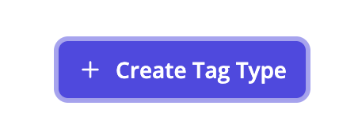
3. Enter:
   - **Tag Type Name** (e.g., Difficulty Level, Subject, Grade)
   - **Description** *(optional)*
4. Click **Save** — you'll be redirected to the Tag Management page
5. Under the created Tag Type, click **Add Tag** and enter each tag value

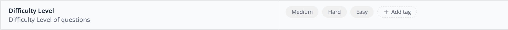

---

## Step 2 — Creating Questions (Question Bank)

Question Management lets you create, organize, and manage questions for use in tests and assessments.

:::tip
You can create questions individually **or** bulk upload them via CSV.
:::

### Option 1 — Create Questions Individually

1. Go to **Question Bank** from the left panel
2. Click **Create Question**

3. Choose a question type:

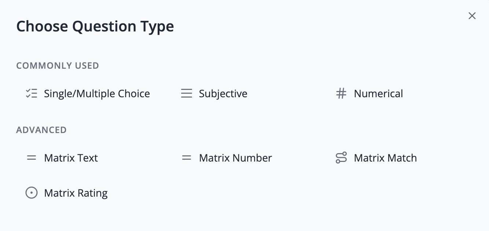

4. Fill in the following details:

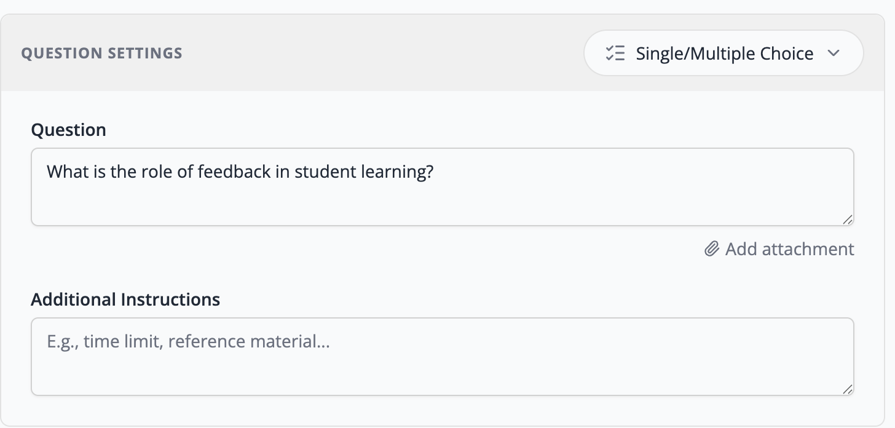

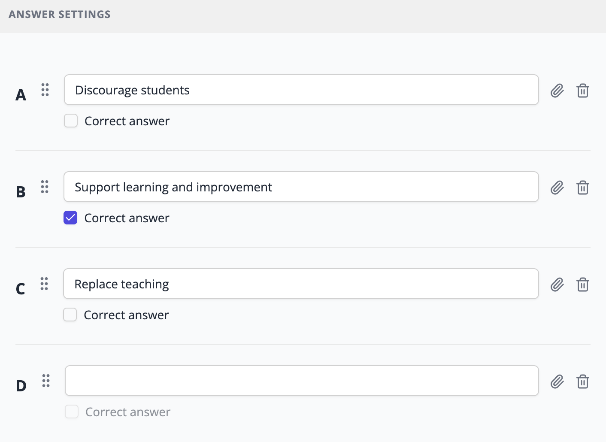

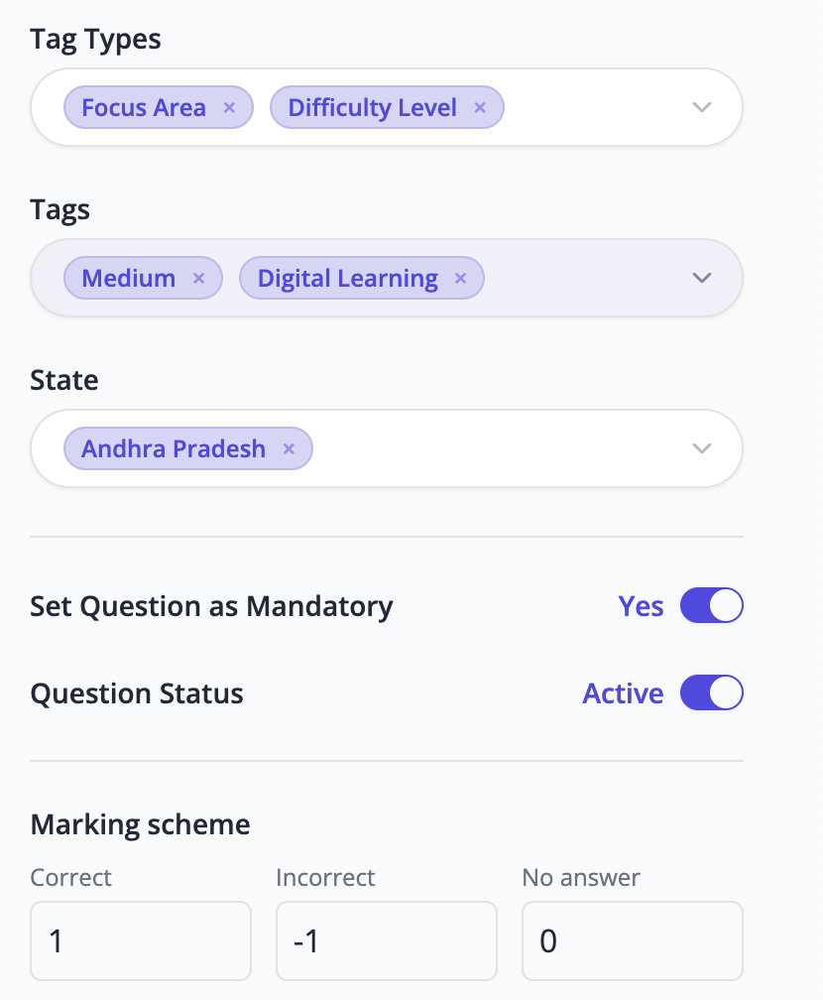

   - **Question Settings** — Question text, Additional Instructions
   - **Answer Settings** — Input answer options and mark the correct answer
   - **Tag Types & Tags** — Select relevant tags (e.g., Difficulty Level → Easy)
   - **State Selection** — Assign to a state *(optional)*
   - **Mandatory** — Toggle whether the question is mandatory
   - **Question Status** — Set to Active or Inactive
   - **Marking Scheme** — Set marks for Correct / Incorrect / No Answer

### Option 2 — Bulk Upload via CSV

1. Click **Bulk Upload** in the Question Bank
2. Download the CSV template provided in the platform
3. Fill in questions and required details using the defined CSV format
4. Upload the completed CSV to add all questions at once

---

## Step 3 — Create Forms

Forms collect candidate information (name, contact details, location, etc.) before a test begins. The form you create here can be selected during test creation under **Candidate Information Form**.

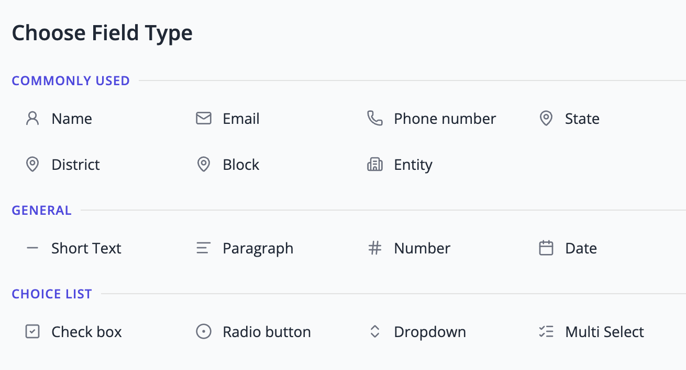

### Primary Details

- Form Name
- Description
- Form Status (Active / Inactive)

### Field Types Available

| Category | Available Field Types |
|---|---|
| Commonly Used | Name, Email, Phone Number, State, District, Block, Entity |
| General | Short Text, Paragraph, Number, Date |
| Choice List | Checkbox, Radio Button, Dropdown, Multi Select |

### Additional Controls

- Minimum / Maximum Length or Value
- Error Message
- Pattern (Regex validation)
- Duplicate field, Delete field, Save form

---

## Step 4 — Certificate Creation

Certificates are issued to candidates after completing a test. You can create templates using Google Slides and link them during test creation.

1. Go to **Certificates** from the left panel → click **Create Certificate**
2. Fill in:
   - **Name** (e.g., Test Completion Certificate)
   - **Description**
   - **Google Slides template link**
3. Use pre-defined tokens in your template:
   - `{{test_name}}` — Name of the test
   - `{{score}}` — Candidate's score
   - `{{completion_date}}` — Date of test submission
4. You can also add custom tokens from form data (e.g., `{{full_name}}`)
5. Set **Status** to **Active** → click **Save**

You can create multiple templates with different designs — they'll be available for selection during test creation.

---

## Step 5 — Test Template Creation

:::info
Test Templates let you quickly create similar tests in the future without reconfiguring all settings manually each time.
:::

The template creation process mirrors the Test Creation process. Configure the required settings and save them as a reusable template.

Configurable options in a template:

- Tag Types and Tags
- State and District
- Number of questions per tag
- Auto or manual question selection
- Pre-test guidelines
- Test completion message
- Language options
- Candidate information form
- Certificate selection
- Test rules

---

## Step 6 — Test Creation

:::tip
You can create a test **manually** or from an existing **Test Template**.
:::

### Create Manually

#### Primary Details

1. Go to **Tests** from the left panel → click **Create Manually**
2. Enter **Test Name** and **Description**
3. Select **Tag Types** (e.g., Difficulty Level, Focus Area)
4. Select **Tags** based on chosen Tag Types (e.g., Easy, Medium, Hard)
5. Select **State / District** — as System Admin, you can choose from all available options; your selections define what State and Test Admins can access

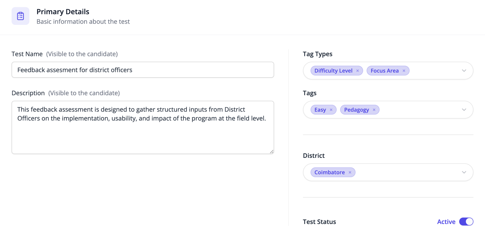

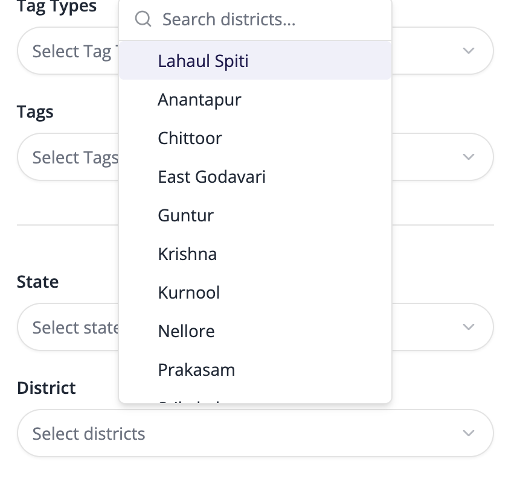

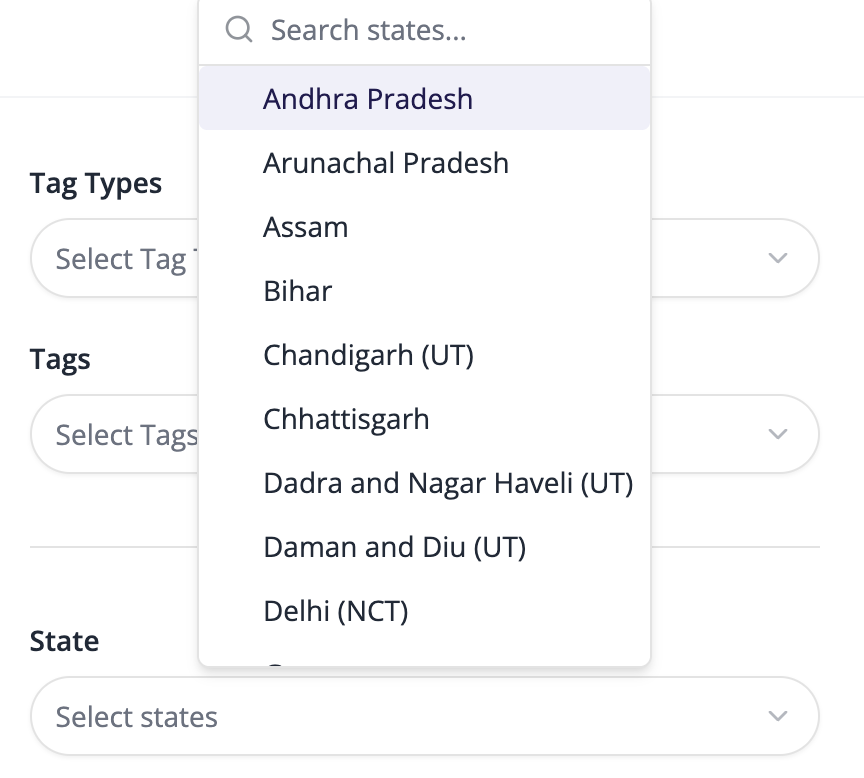

#### Select Questions

**Auto Selection**

1. Select tags for the assessment (e.g., Difficulty Level → Easy, Focus Area → Pedagogy)
2. Specify the number of questions to pull per tag
3. The platform automatically pulls matching questions from the Question Bank

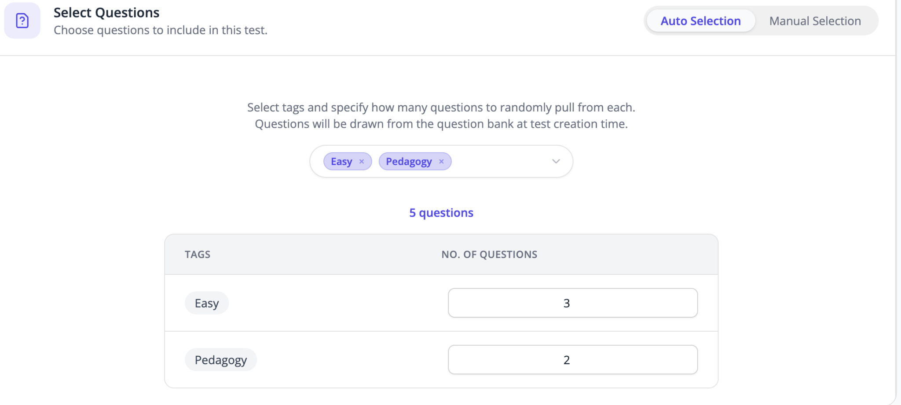

**Manual Selection**

1. Browse questions in the Question Bank
2. Filter using tags and other filters
3. Select and add the required questions to the test

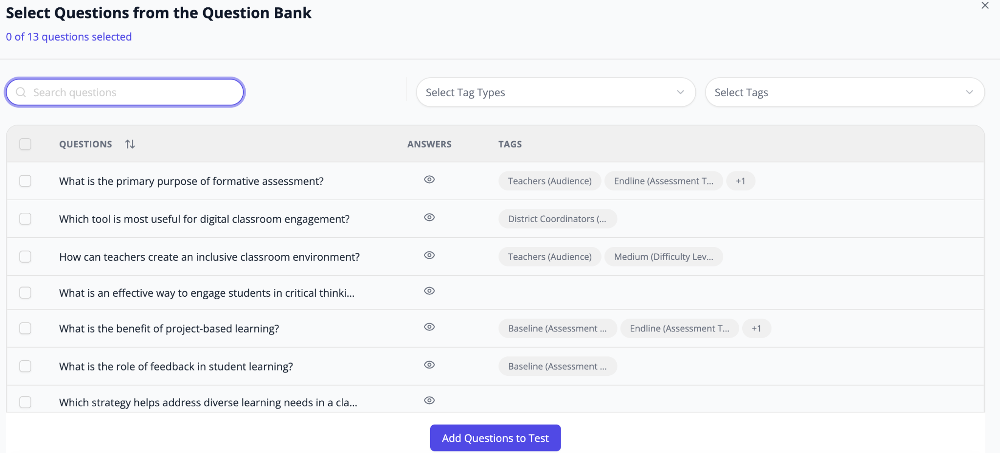

#### Test Configuration

**Test Schedule**

- Set the **start date/time** and **end date/time**
- Candidates can only access the test during this window

**Candidate Experience**

- **Pre-test Guidelines** — Add instructions (internet requirements, rules, dos & don'ts)
- **Test Completion Message** — Show a message after submission (confirmation, next steps)
- **Language** — Set the language for the assessment portal
- **Candidate Information Form** — Select a form to collect candidate details before the test
- **Certificate** — Select the certificate template to issue on completion

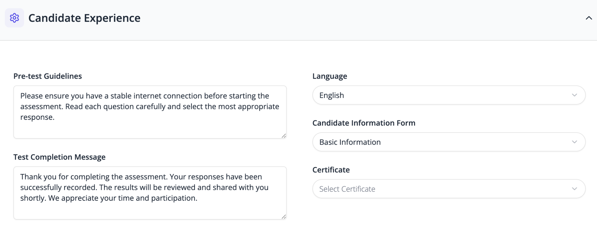

**Test Rules**

- Shuffle question order per candidate
- Show marks to candidates during the test
- Display results immediately after test completion

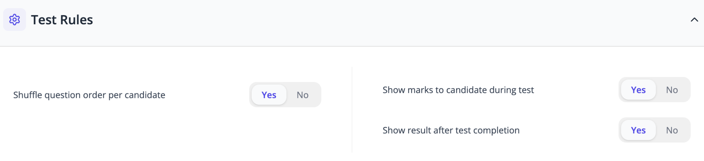

### Create from Test Template

- Select a previously saved template to auto-apply all configurations
- Search/filter templates by name, State, District, Tag Types, or Tags
- Review settings and proceed — all template configurations are applied automatically

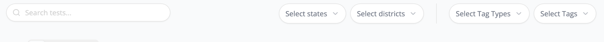

---

## Step 7 — Publish Test

After clicking **Save**, the test appears in the **Tests** section. From there you can:

- **Duplicate** the test
- **Copy Test Link** to share with candidates
- **Download QR Code** to share with candidates
- **View Reports** and candidate results
- **Edit** test details and configuration
- **Delete** the test

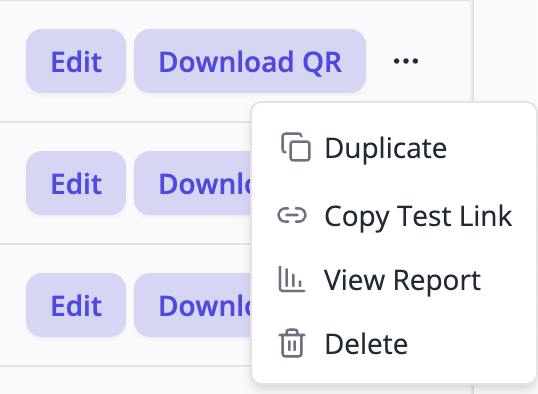

---

## Step 8 — Create User

1. Go to **Users** from the left panel → click **Create User**
2. Enter:
   - Name, Email, Phone Number
   - Password & Confirm Password
   - **Role** — System Admin / State Admin / Test Admin
   - **User Status** — Active
3. Click **Save**

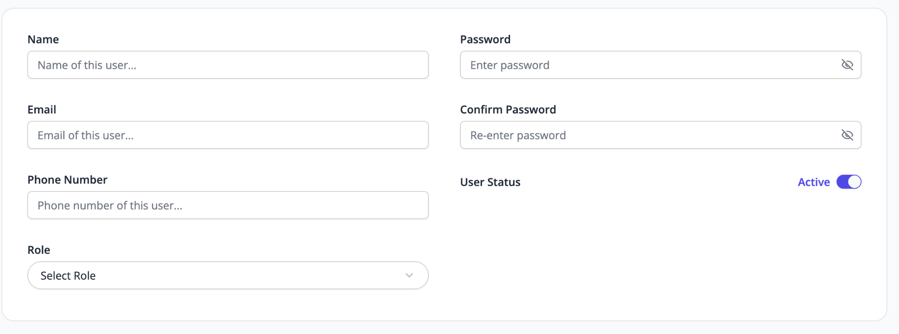

You can enable or disable a user's active status at any time.
