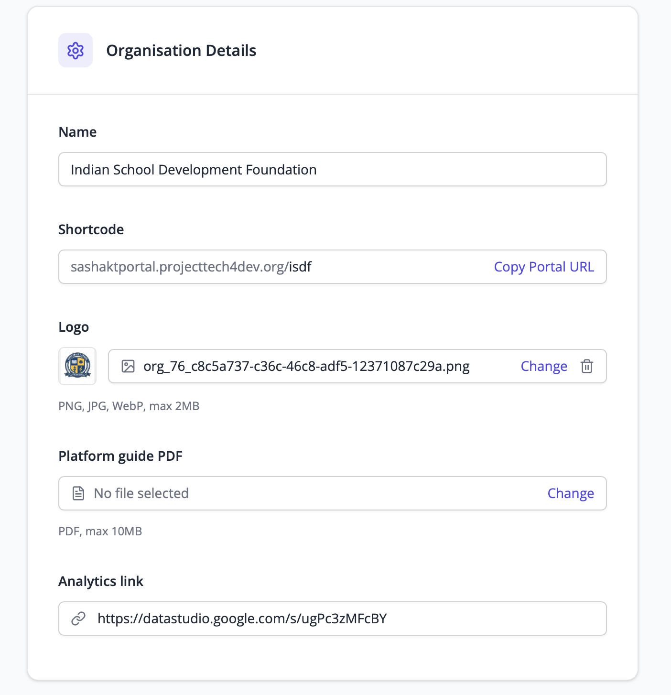
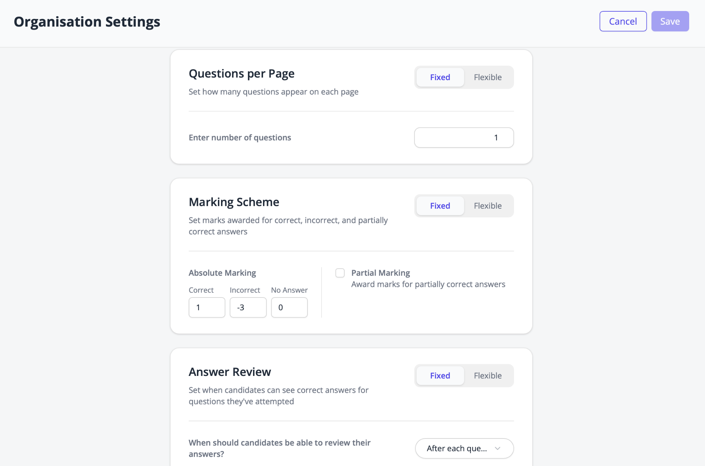
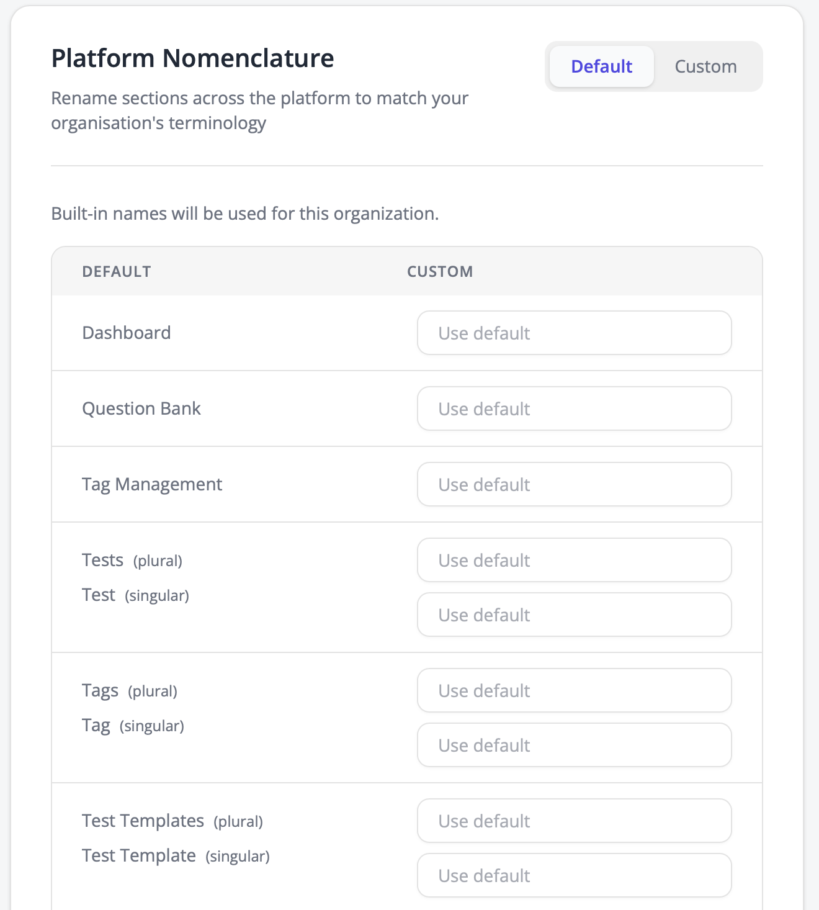

# Overall Workflow

The main navigation (left panel) includes:

| Sr. | Navigation menu | What you can do |
|-----|-----------------|-----------------|
| 1 | Tests | Create, manage, publish tests and view reports/results |
| 2 | Test Templates | Create reusable test structures based on tags or question sets |
| 3 | Question Bank | Add, edit, and manage all questions (manual or CSV upload) |
| 4 | Tag Management | Create and organize tags used to categorize questions and tests |
| 5 | Forms | Create and manage forms to collect candidate details before the start of a test. |
| 6 | Certificates | Create and manage certificate templates for candidates who complete tests. |
| 7 | Users | Add and manage users of various roles like state-admins, test-admins, etc. |
| 8 | My Organisation | Configure organisation settings such as organisation name, logo, test rules, and platform labels. |

---

## Overall workflow

**Tags → Questions → (Templates) → Tests**

---

## Step 1 — Setting up Tags

Tag Management is used to create and organize tags that help categorize questions and tests. Tags make it easier to filter, group, and auto-select questions while creating assessments.

Tags can be grouped under a **Tag Type**, which acts as a category for related tags.

> For example, Tag type can be 'Difficulty Level' with tags like 'Easy', 'Medium', or 'Hard' grouped under it.

1. Go to **Tag Management** from the left panel
2. Click on **Create Tag Type**

3. Enter:
   - **Tag Type Name** (e.g., Difficulty Level, Subject, Grade)
   - **Description** *(optional)* (eg — Difficulty level of questions)
   - Click **Save**
4. You will be redirected to the Tag Management page, where your new Tag Type will be visible
5. Under the created Tag Type, add individual Tags

   **Example:**
   - Tag Type: Difficulty Level
   - Tags: Easy, Medium, Hard

6. Click **Add Tag** next to the Tag Type and enter each tag value

---

## Step 2 — Creating Questions (Question Bank)

Question Management is used to create, organize, and manage questions that can later be used in tests and assessments.

:::tip
You can either create questions individually or bulk upload questions in CSV format.
:::

### Option 1 — Creating questions in Question Bank

1. Go to **Question Bank** from the left panel
2. Click on **Create Question**

3. Choose question type from the options given

4. Enter the following details:

   - **Question Settings** — Question, Additional Instructions
   - **Answer Settings** — Input the answer options and choose the correct answer
   - Select from the Tag Types created earlier (Difficulty level) and Tags (Easy, Medium, Hard). You can select multiple tags like — Difficulty level, Focus area, audience etc based on whatever you have created in the previous step
   - **State Selection** — Assign question to a particular state from the dropdown *(optional)*
   - Set question as mandatory or not
   - Mark the question as Active or Inactive based on whether it should be available for use
   - **Marking Scheme** — Assign marks for correct answers and specify negative marking for incorrect or unanswered questions

> Now this question will be saved in your question bank which can be used in the following steps to create tests.

### Option 2 — Adding Questions in Bulk (CSV Upload)

1. Click on the **Bulk Upload** option to upload multiple questions at once.
2. Download the CSV template provided in the platform.
3. Add the questions and required details in the downloaded template using the defined CSV format.
4. Upload the completed CSV file to add all questions to the Question Bank in one go.

---

## Step 3 — Create Forms

Forms are used to collect candidate information before they start a test, such as name, contact details, location, or other required details.

The forms created here can later be selected during test creation under the **Candidate Information Form** option. During test creation, the form name will appear in the dropdown, allowing you to choose the appropriate form to collect candidate details before the test begins.

In the Form Creation page, you have the following options available:

### Primary Details

- Form Name
- Description
- Form Status (Active / Inactive)

### Field Configuration Options

| Category | Available Field Types |
|---|---|
| Commonly Used Fields | Name, Email, Phone Number, State, District, Block, Entity |
| General Fields | Short Text, Paragraph, Number, Date |
| Choice List Fields | Checkbox, Radio Button, Dropdown, Multi Select |

### Additional Controls

- Minimum Length / Minimum Value
- Maximum Length / Maximum Value
- Error Message
- Pattern (Regex validation)

### Other Actions

- Duplicate field
- Delete field
- Save form

---

## Step 4 — Certificate Creation

Certificates are used to generate completion certificates for candidates after they finish a test. You can create and manage certificate templates that can later be selected during test creation.

1. Go to the **Certificates** option on the left panel and click **Create Certificate**.
2. Fill in:
   - **Name** (e.g., Test Completion Certificate)
   - **Description**
   - Paste your **Google Slides template link**
3. You can use pre-defined tokens in your template, like the ones below:
   - `{{test_name}}` — To show name of test in Certificate
   - `{{score}}` — To show score of candidate
   - `{{completion_date}}` — To show date of submission of test
4. You can also create custom tokens using the Forms functionality. Data collected through candidate forms can be used in certificates.

   For example: `{{full_name}}` can be used to display the candidate's full name on the certificate.

5. Set the certificate **Status** to **Active**.
6. Click **Save**.
7. You can create multiple certificate templates using different Google Slides designs. These certificates can later be selected while creating tests.

---

## Step 5 — Test Template Creation

:::info
Test Templates help you quickly create similar tests in the future without configuring all settings manually each time. During test creation, you can choose to either create a test manually or use an existing template.
:::

The template creation process is similar to the Test Creation process. Configure the required settings and save them as a reusable template.

While creating the template, you can configure custom options such as:

- Tag Types and Tags
- State and District
- Number of questions for each tag
- Auto-selection or manual selection of questions
- Pre-test guidelines
- Test completion message
- Language options
- Candidate information form
- Certificate selection
- Test rules

The detailed steps for configuring these options are explained in the Test Creation section.

Once created, the template can be reused to quickly set up future tests with similar configurations.

---

## Step 6 — Test Creation

:::tip
You can either create a test manually or create from a Test Template.
:::

### Create Manually

#### Primary Details

1. Go to **Tests** option on the left panel
2. Click on **Create Manually** option
3. Enter **Test Name** and **Description** details (for example — Feedback assessment for district officers)
4. Select the **Tag Types** to filter and view the relevant tags available in the platform. (For example: Difficulty Level, Focus Area, Audience, Assessment Type, etc.)
5. Based on the selected Tag Types, the related **Tags** will appear in the dropdown for selection. These selected tags will then be associated with the test. (For example: If "Difficulty Level" is selected as the Tag Type, tags such as Easy, Medium, and Hard will be available for selection.)
6. **Select the district** — As a System Admin, you will be able to view and select from all available states and districts in the system. Only the states and districts selected by you will be available for the State Admin and Test Admin to choose from while preparing or creating tests.

#### Select Questions (Auto / Manual)

**Auto Selection**

The platform allows you to automatically select questions for a test based on the tags chosen during test creation.

1. Select the required tags for the assessment. (For example: Difficulty Level → Easy, Focus Area → Pedagogy)
2. Specify the number of questions to be selected for each tag.
3. The platform will automatically pull matching questions from the Question Bank based on the selected tags and configured count.

This helps create balanced assessments quickly without manually selecting individual questions.

**Manual Selection**

You can also manually select questions to include in the test.

1. Browse and view questions available in the Question Bank.
2. Use tags and other filters to find relevant questions.
3. Select the required questions and add them to the test manually.

This option gives you full control over exactly which questions are included in the assessment.

#### Test Configuration

**Test Schedule**

Configure the duration for which the test will remain available to candidates by selecting the test start date and time, and the end date and time. Candidates will only be able to access the test during this scheduled period.

**Candidate Experience**

1. With **pre-test guidelines**, you can add instructions or important information for candidates before they begin the test, such as internet requirements, test duration, rules, and dos & don'ts.
2. Add a message that will be displayed to candidates after they successfully submit the test. This can include submission confirmation, result-related information, or instructions on the next steps.
3. You can set the language in which candidates will view the assessment portal.
4. With the **candidate information form**, we can select the form that should be shown to candidates before they start the test to collect the required candidate details. These forms can be created and managed using form management from side-bar.
5. Select the **certificate template** that should be issued to candidates after they complete the test. Certificate templates can be created and managed separately using the Certificates module.

**Test Rules**

1. You can choose to shuffle questions for each candidate to reduce copying.
2. You can choose to show marks during the test for real-time visibility.
3. You can choose to display results immediately after the test is completed.

### Create from Test Template

- You can quickly create a new test by selecting a previously created Test Template. Templates help save time by automatically applying all the predefined configurations and settings, eliminating the need to manually configure each option again.
- Use the available search and filter options to easily find the required template. You can search templates by name or filter them using States, Districts, Tag Types, and Tags.

- Simply choose the required template, review the settings if needed, and proceed with creating the test. All configurations included in the selected template — such as tags, question selection method, language options, certificates, test rules, and other settings — will be automatically applied to the new test.

---

## Step 7 — Publish Test

Once you click **Save**, the test will be available under the **Tests** section. You can view and manage the test anytime from the Tests option in the left panel.

From there, you can:

- **Duplicate** the test
- **Copy test link** that can be shared
- **Download the QR code** to share with candidates
- **View reports** and summary of the candidates once they start attempting the test
- **Edit** the test details and configuration if needed
- **Delete** the test

---

## Step 8 — Create User

1. Navigate to **Users** on the left panel → **Create User**
2. Enter user details:
   - Name
   - Email
   - Phone Number
   - Set login credentials:
     - Password
     - Confirm Password
   - Select Role:
     - System Admin / State Admin / Test Admin
   - Set **User Status** to Active (you can enable or disable a user's active status at any time as needed)
   - Click **Save**

---

## Step 9 — Organisation Settings

### Organisation Details

The Organisation Details section allows you to configure and manage basic organisation-level information and branding for the platform.

Here, you can:

- Update the organisation name and shortcode
- Upload the organisation logo that will appear across the platform
- Upload a Platform Guide PDF for users to reference
- Configure the analytics/reporting dashboard link
- Copy and share the organisation's portal URL

These settings help personalize the platform experience for your organisation and users.

### Organisation Settings

The Organisation Settings section is used to configure organisation-level rules and default configurations for tests across the platform.

These settings help standardize the test experience and reduce the number of configuration options that users need to manage while creating tests. By defining rules at the organisation level, Test Admins and other users will only see the relevant and allowed options during test creation, making the process simpler and less cluttered.

Some examples of organisation-level settings include:

- Number of questions displayed per page
- Default marking scheme and partial marking rules
- Answer review settings for candidates
- Other default test behavior and configuration rules

These settings can be configured as:

- **Fixed** — Users cannot modify the setting during test creation
- **Flexible** — Users can customize the setting while creating a test

The following settings can be configured at the organisation level to define default test behavior and control which options are available during test creation:

- **Test Timings** — Configure rules related to test duration, scheduling, and time limits for assessments.
- **Questions Per Page** — Define how many questions should appear on a single page during the test. This can be fixed for all tests or made configurable during test creation.
- **Marking Scheme** — Configure default scoring rules such as marks for correct answers, negative marking for incorrect answers, marks for unanswered questions, and partial marking rules.
- **Answer Review** — Control when and how candidates can review their answers or view correct responses during or after the test.
- **Question Palette** — Configure the visibility and behavior of the question palette shown to candidates for navigating between questions.
- **Mark for Review** — Configure whether candidates are allowed to mark questions for later review during the test.
- **OMR Mode** — Configure OMR-style test behavior and navigation settings for assessments that follow an OMR-based experience.

### Platform Nomenclature

The Platform Nomenclature setting allows organisations to customize the terminology used across the platform to match their internal language and workflows.

You can rename platform sections and labels such as:

- Tests
- Tags
- Test Templates
- Question Bank
- Dashboard
- And other platform modules

For example:

- "Tests" can be renamed to "Assessments"
- "Tags" can be renamed to "Competencies"
- "Question Bank" can be renamed to "Content Library"

This helps organisations provide a more familiar and customized experience for their users. You can either use the default platform terminology or configure custom names based on your organisation's preferences.
